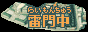

# stripeToImage

This program converts an image splitted in stripes into its full version.

It was made to convert image data found in old games files

## How to use :

Put all of your images in a folder named input located in the same place as the executable file

If all of your images share the same section count :

```
javac Converter.java
java Converter sectionCount
```

Else : 

```
javac Converter.java
java Converter sectionCountForImage1 sectionCountForImage2 sectionCountForImage3...
```

## Input :


## Output :



